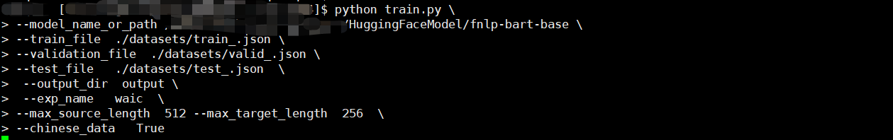
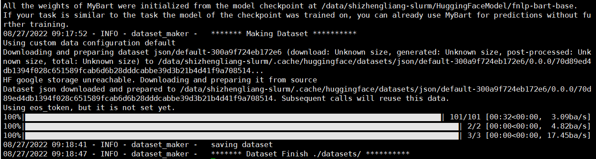
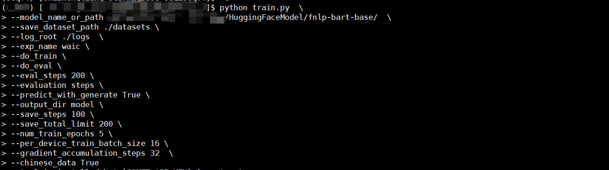
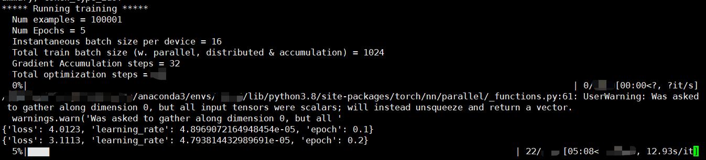
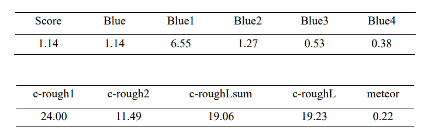

# World Artificial Intelligence Conference (WAIC) Competition


## Dataset and pre-process

raw data format：

```txt
{
        {
            'content':...,
            'summary':...,
            'qdomain':...,
            'adomain':...,
            'retrieval':{
                'search_news':[{'score':...,'title':...,'content':...},...],
                'search_point':[{'score':...,'title':...,'content':...},...],
                'search_xueqiu':[{'score':...,'title':...,'content':...},...],
                'search_qa':[{'score':...,'answer':...,'query':...},...]
            }
    	},
		{...},
         ...
}
```

For each query $q$, we first search the similar queries $Q'={q'_1, q'_2,...}$ and corresponding answers $A'={a'_1, a'_2,...}$ from the corpus. The answers $A'$ are rich in external knowledge, which will be taken as input paired with raw query $q$. The details for code implementation can be found in the `dataprepare.py` file. 

Run the following commend to pre-process the data.

```shell
python dataprepare.py
```


The processed data are stored in `train_.josn`,`test_.json`,`valid_.json` by default.


## How to train the model?

We take the Chinese-BART as the foundation model, which has been pre-trained on extensive Chinese corpus. We use the `transformers` library for implementation. (see more details in the `train.py` file)

### Steps to reproduce our result

1. create a new folder named `datasets`, which contains the processed dataset `train_.josn`, `test_.json`, and `valid_.json`. (the file name should remain the same as it is in `train.py`)
2. run the following command to construct the training data with (transfer the JSON format into `transformer` style data format)

```txt
python3 run_mybart.py --model_name_or_path fnlp-bart-base \
--train_file ./dataset/train_.json \
--validation_file ./dataset/valid_.json \
--test_file ./dataset/test_.json \
--output_dir output \
--exp_name waic \
--max_source_length 512  \
--max_target_length 256 \
--chinese_data True
```

specifically, the parameter configure is:

```txt
--model_name_or_path:  the name of foundation model（e.g., model name in huggingface platform or local path)
--train_file        :  the data path for processed training data
--valid_file        :  the data path for processed validation data
--test_file         :  the data path for processed test data
--output_dir        :  the output folder, which used to store the checkpoint or log
--max_source_length :  max length for input
--max_target_length :  max length for output
--chinese_data      :  using Chinese data or not 
```

<span style="color:red;font-weight:bold;">Note, the environment `comet_ml` may need to install via `pip install comet_ml` </span>

The successful running state:



after processing:



**The huggingface-style datasets are stored in the `datasets` folder by default. In our project, we have provided the hugging face style datasets for practical purposes. **


3. run the `train.py` for training the model.
   
```txt
python train.py  \
--model_name_or_path /data/shizhengliang-slurm/HuggingFaceModel/fnlp-bart-base/  \
--save_dataset_path ./datasets \
--log_root ./logs  \
--exp_name waic \
--do_train \
--eval_steps 200 \
--evaluation steps \
--predict_with_generate True \
--output_dir model \
--save_steps 100 \
--save_total_limit 200 \
--num_train_epochs 5 \
--per_device_train_batch_size 16 \
--gradient_accumulation_steps 32  \
--chinese_data True 
```

The details for configures are:

```txt
--model_name_or_path:          :  the name of foundation model（e.g., model name in huggingface platform or local path)
--save_dataset_path            :  the dataset path (path for storing huggingface-style dataset )
--output_dir                   :  the output folder, which used to store the checkpoint or log
--max_source_length            :  max length for input
--max_target_length            :  max length for output
--chinese_data                 :  using Chinese data or not 
--per_device_train_batch_size  :  batch size for each GPU device
--gradient_accumulation_steps  :  gradient accumulation steps
--save_steps                   :  interval steps for saving checkpoint
--num_train_epochs             :  training epoch
--evaluation                   :  evaluation mode (evaluate for each epoch or certain steps)
--eval_step                    :  interval steps for evaluation
--do_train                     :  train or not
--do_eval                      :  evaluation or not
--predict_with_generate        :  decode the token into Chinese character or not
```

The successful running state.




training process




## How to inference

Using the checkpoint stored during the training, and run the following commend for inference. (see more details in `inference.py` file)

```txt
python inference.py  \
--model_name_or_path ./logs/seq2seqV4/waic/model/checkpoint-350 \
--log_root ./logs \
--save_dataset_path ./datasets \
--exp_name waic \
--predict_with_generate True \
--output_dir model 
```


**./logs/seq2seqV4/waic/model/checkpoint-350 is the checkpoint path**


## Environment configure

The GPU device is:


We evaluate our checkpoint on the validation dataset and test on the test dataset. The result in the test dataset is:




## Contact

For any questions, feel free to contact me via email

```txt
Email : 1172159897@qq.com ; shizhl@mail.sdu.edu.cn
```

## Project folder for reference

```txt
WAIC
├── BestCheckpoint                # the best checkpoint，used for inference
│   ├── config.json
│   ├── optimizer.pt
│   ├── pytorch_model.bin
│   ├── scheduler.pt
│   ├── special_tokens_map.json
│   ├── tokenizer_config.json
│   ├── trainer_state.json
│   ├── training_args.bin
│   └── vocab.txt
├── datasets                      # dataset path
│   ├── dataset_dict.json         
│   ├── test                     
│   │   ├── cache-7c5e3e9ecb704a31.arrow
│   │   ├── dataset_info.json
│   │   └── state.json
│   ├── test_.json                
│   ├── test.txt
│   ├── train                     # train dataset
│   │   ├── cache-befd04cbc1089214.arrow
│   │   ├── dataset_info.json
│   │   └── state.json
│   ├── train_.json
│   ├── validation                # validation dataset
│   │   ├── cache-d126d4c4bb3bd269.arrow
│   │   ├── dataset_info.json
│   │   └── state.json
│   └── valid_.json
├── magic_bart2.py                # backbone model
├── requirements.txt              # pip install -r requirements.txt for configure 
├── evaluation.py                 # BLUE，ROUGH metrics
├── train.py                      # train file
├── inference.py                  # inference file
├── args.py                       # hyper-parameters
├── dataprepare.py                # retrieval argumentation for data pre-process
├── dataset_maker.py              # 
└── list.txt                      # details for project path 
```

