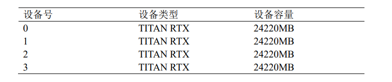

[toc]


# WAIC-黑客松：行情波动下的金融问答挑战赛

## 数据描述与数据预处理

原始数据：

```json
{
        {
            'content':...,
            'summary':...,
            'qdomain':...,
            'adomain':...,
            'retrieval':{
                'search_news':[{'score':...,'title':...,'content':...},...],
                'search_point':[{'score':...,'title':...,'content':...},...],
                'search_xueqiu':[{'score':...,'title':...,'content':...},...],
                'search_qa':[{'score':...,'answer':...,'query':...},...]
            }
    	},
		{...},
         ...
}
```


将**retrieval.search_qa**中相关性最高的问题对应的**答案**拼接到原问题答案中，即
$$
summary=summary+retrieval.search_qa[0].answer
$$
注意：retrieval.search_qa中的问题按照相关性递减排列，因此第一个问题就是最相关的问题


代码实现：详见`dataprepare.py`文件

```shell
python dataprepare.py
```


得到预处理后的文件`train_.josn`,`test_.json`,`valid_.json`.


## 模型训练

采用在中文语料上预训练过的bart作为基座模型，并通过huggingface作为接口。（详见`train.py`文件）

具体步骤如下：

1. 首先新建文件夹，并命名为`datasets`,将上述预处理好数据文件`train_.josn`,`test_.json`,`valid_.json`放入其中（文件夹命名必须需要与`train.py`中的文件路径对应，此处以`dataset`为例)
2. 首先将上文中预处理好的数据转化为huggingface内置的`datasets`类

```shell
python3 run_mybart.py --model_name_or_path fnlp-bart-base \
--train_file ./dataset/train_.json \
--validation_file ./dataset/valid_.json \
--test_file ./dataset/test_.json \
--output_dir output \
--exp_name waic \
--max_source_length 512  \
--max_target_length 256 \
--chinese_data True
```

参数的意义如下所示：

```txt
--model_name_or_path:  基座模型的名称（对应huggingface中model模块的命名），或者是本地模型的保存路径
--train_file        :  预处理后的训练数据
--valid_file        :
--test_file         :
--output_dir        :  输出的文件夹，可随便指定
--max_source_length :  最大输入长度（可截断）
--max_target_length :  最大输出长度
--chinese_data      :  是否使用中文数据
```

<span style="color:red;font-weight:bold;">注意：如果缺少comet_ml，需要手动pip安装 </span>

实际运行结果：


处理之后


**上述处理后的数据默认被保留在`datasets`文件夹中。项目文件中已经完成这一步，可以直接从下述的第三步开始执行**


3. 再次运行`train.py`文件，开始训练模型，对应命令行

```shell
python train.py  \
--model_name_or_path /data/shizhengliang-slurm/HuggingFaceModel/fnlp-bart-base/  \
--save_dataset_path ./datasets \
--log_root ./logs  \
--exp_name waic \
--do_train \
--eval_steps 200 \
--evaluation steps \
--predict_with_generate True \
--output_dir model \
--save_steps 100 \
--save_total_limit 200 \
--num_train_epochs 5 \
--per_device_train_batch_size 16 \
--gradient_accumulation_steps 32  \
--chinese_data True 
```

参数的意义如下所示：

```txt
--model_name_or_path:          :  基座模型的名称（对应huggingface中model模块的命名），或者是本地模型的保存路径
--save_dataset_path            :  第2步中转化成datasets类之后对应的文件夹(源代码中默认为./datasets/)
--output_dir                   :  输出的文件夹，可随便指定
--max_source_length            :  最大输入长度（可截断）
--max_target_length            :  最大输出长度
--chinese_data                 :  是否使用中文数据
--per_device_train_batch_size  :  每一个GPU设备上的batch size大小
--gradient_accumulation_steps  :  梯度累计的步数
--save_steps                   :  每训练多少步保留checkpoint
--num_train_epochs             :  一共训练多少轮
--evaluation                   :  评估的方式（可选参数 epoch :每一轮评估一次，step:每间隔指定步数评估一次） 
--eval_step                    :  每间隔指定步数评估一次
--do_train                     :  是否训练
--do_eval                      :  是否验证
--log_root                     :  设置程序运行时checkpoint以及各种输出文件保存的文件夹
--predict_with_generate        :  是否解码（将词表中的编码转化为汉字）
```

实际效果


正常训练


## 如何推断

在模型的训练过程中会保存checkpoint，可以使用如下命令在测试集上进行推断。（详见`inference.py`文件）

```shell
python inference.py  \
--model_name_or_path ./logs/seq2seqV4/waic/model/checkpoint-350 \
--log_root ./logs \
--save_dataset_path ./datasets \
--exp_name waic \
--predict_with_generate True \
--output_dir model 
```


```txt
./logs/seq2seqV4/waic/model/checkpoint-350 为训练过程中保存的checkpoint
```


## 实验环境和结果

本实验所采用的硬件环境如下




经过多次测试，模型最优性能为：


# 写在最后

## 联系作者

如果对本项目有任何疑问，请联系作者

```txt
QQ    : 1172159897
Email : 1172159897@qq.com ; shizhl@mail.sdu.edu.cn
```

## 项目文件路径

```txt
WAIC
├── BestCheckpoint                # 最优checkpoint，可以通过inference.py文件，将--model_name_or_path设置为对应路径进行推断
│   ├── config.json
│   ├── optimizer.pt
│   ├── pytorch_model.bin
│   ├── scheduler.pt
│   ├── special_tokens_map.json
│   ├── tokenizer_config.json
│   ├── trainer_state.json
│   ├── training_args.bin
│   └── vocab.txt
├── datasets                      # 最终处理好的数据集，可以直接用于train.py的训练（详见上述模型训练的第3步）
│   ├── dataset_dict.json         # 数据集映射文件（详见上述模型训练第2步）
│   ├── test                      # 测试集
│   │   ├── cache-7c5e3e9ecb704a31.arrow
│   │   ├── dataset_info.json
│   │   └── state.json
│   ├── test_.json                # 预处理后的测试集（取出来无用字段）
│   ├── test.txt
│   ├── train                     # 训练集
│   │   ├── cache-befd04cbc1089214.arrow
│   │   ├── dataset_info.json
│   │   └── state.json
│   ├── train_.json
│   ├── validation                # 验证集
│   │   ├── cache-d126d4c4bb3bd269.arrow
│   │   ├── dataset_info.json
│   │   └── state.json
│   └── valid_.json
├── magic_bart2.py                # 模型骨干结构
├── requirements.txt              # 环境，如果缺少comet_ml，可额外手动pip安装
├── evaluation.py                 # 计算BLUE，ROUGH等指标
├── train.py                      # 模型训练文件
├── inference.py                  # 模型推断文件
├── args.py                       # 命令行参数文件
├── dataprepare.py                # 构造检索增强的数据集
├── dataset_maker.py              # 构造huggingface的datasets类    
└── list.txt                      # 项目路径
```


## 其他说明文件

```txt
├── README.md                     # 项目说明（本文件）
├── README.pdf                    # 项目说明PDF版
├── 技术报告.pdf                   # 技术报告  
├── output_checkpoint_375 .csv   # 输出文件样例
```

